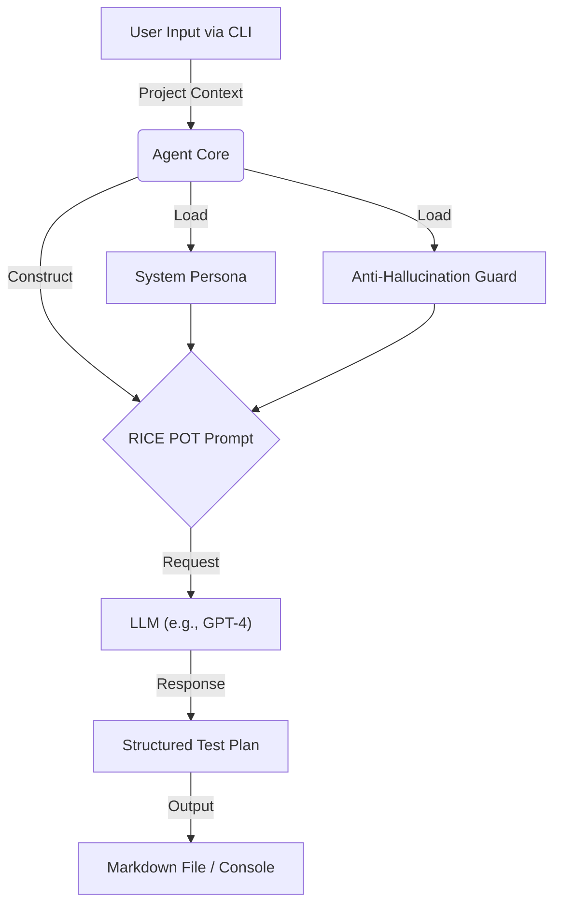

# AI Test Plan Generator Agent

[](https://choosealicense.com/licenses/mit/)

**A pragmatic, anti-hallucination AI Agent for generating IEEE 829 standard test plans.**

This agent leverages a "RICE POT" prompting strategy and strict guardrails to produce realistic, actionable, and structured test plans for any software project. It is designed to act as a **Senior QA Lead**, ensuring verification of inputs and avoiding common AI pitfalls.

## 🏗️ Architecture

The agent follows a strict flow to ensure quality and consistency:



## 🚀 Features

- **IEEE 829 Compliance**: Generates standard-aligned test plans.
- **Anti-Hallucination**: identifying missing info instead of inventing it.
- **Context-Aware**: Adapts to simplified "Sprints" or full "Waterfalls" based on input.
- **Customizable**: Plug in your own LLM backend (OpenAI, Anthropic, etc.).

## 📂 Project Structure

```bash
Test_Plan_Generator_Agent/
├── test_plan_generator.py       # Main agent logic & CLI
├── system_prompt.md             # Defines flow, persona, and output rules
├── anti_Hallucination_Guard.md  # Strict verification rules (The Watchdog)
├── ai_testPlanning.md           # RICE POT framework & prompt templates
└── README.md                    # Documentation
```

## 🛠️ Installation & Setup

1.  **Clone the Repository**
    ```bash
    git clone https://github.com/your-repo/test-plan-agent.git
    cd Test_Plan_Generator_Agent
    ```

2.  **Install Dependencies**
    ```bash
    pip install openai
    ```

3.  **Environment Configuration**
    Set your API Key (e.g., OpenAI) as an environment variable:
    ```bash
    # Windows (PowerShell)
    $env:OPENAI_API_KEY="your-key-here"
    
    # Mac/Linux
    export OPENAI_API_KEY="your-key-here"
    ```

## 💻 Usage

Run the generator from the terminal with your project details:

```bash
python test_plan_generator.py \
  --project "FinTech Dashboard" \
  --type "Web Application" \
  --features "Login, Transaction History, PDF Export, Admin Panel" \
  --tech "React, Node.js, AWS, PostgreSQL" \
  --team "3 QA, 1 Lead" \
  --time "3 Weeks" \
  --env "Staging"
```

### Command Line Arguments

| Argument | Description | Required | Application |
| :--- | :--- | :--- | :--- |
| `--project` | Name of the project | Yes | Context |
| `--type` | App type (Web/Mobile/API) | Yes | Strategy |
| `--features` | Comma-separated feature list | Yes | Scope |
| `--tech` | Tech stack used | Yes | Tooling |
| `--team` | Team composition | Yes | Schedule |
| `--time` | Available timeline | Yes | Schedule |
| `--env` | Target environment | No | Config |

## 🤝 Contributing

We welcome contributions! Please follow these steps to contribute:

1.  **Fork** the repository.
2.  **Create a Branch** for your feature (`git checkout -b feature/AmazingFeature`).
3.  **Commit** your changes (`git commit -m 'Add some AmazingFeature'`).
4.  **Push** to the branch (`git push origin feature/AmazingFeature`).
5.  **Open a Pull Request**.

### Guidelines
- Ensure any new prompt logic maintains the **Anti-Hallucination** standards.
- Update documentation if you change CLI arguments.

## 📜 License

This project is licensed under the MIT License - see the LICENSE file for details.

```text
MIT License

Copyright (c) 2026

Permission is hereby granted, free of charge, to any person obtaining a copy
of this software and associated documentation files (the "Software"), to deal
in the Software without restriction, including without limitation the rights
to use, copy, modify, merge, publish, distribute, sublicense, and/or sell
copies of the Software, and to permit persons to whom the Software is
furnished to do so, subject to the following conditions:

The above copyright notice and this permission notice shall be included in all
copies or substantial portions of the Software.

THE SOFTWARE IS PROVIDED "AS IS", WITHOUT WARRANTY OF ANY KIND, EXPRESS OR
IMPLIED, INCLUDING BUT NOT LIMITED TO THE WARRANTIES OF MERCHANTABILITY,
FITNESS FOR A PARTICULAR PURPOSE AND NONINFRINGEMENT. IN NO EVENT SHALL THE
AUTHORS OR COPYRIGHT HOLDERS BE LIABLE FOR ANY CLAIM, DAMAGES OR OTHER
LIABILITY, WHETHER IN AN ACTION OF CONTRACT, TORT OR OTHERWISE, ARISING FROM,
OUT OF OR IN CONNECTION WITH THE SOFTWARE OR THE USE OR OTHER DEALINGS IN THE
SOFTWARE.
```

## ✍️ Author

**Vishal Chincholi**
- **Role**: QA LEad
-

---
*Built with ❤️ for QA Engineers.*
